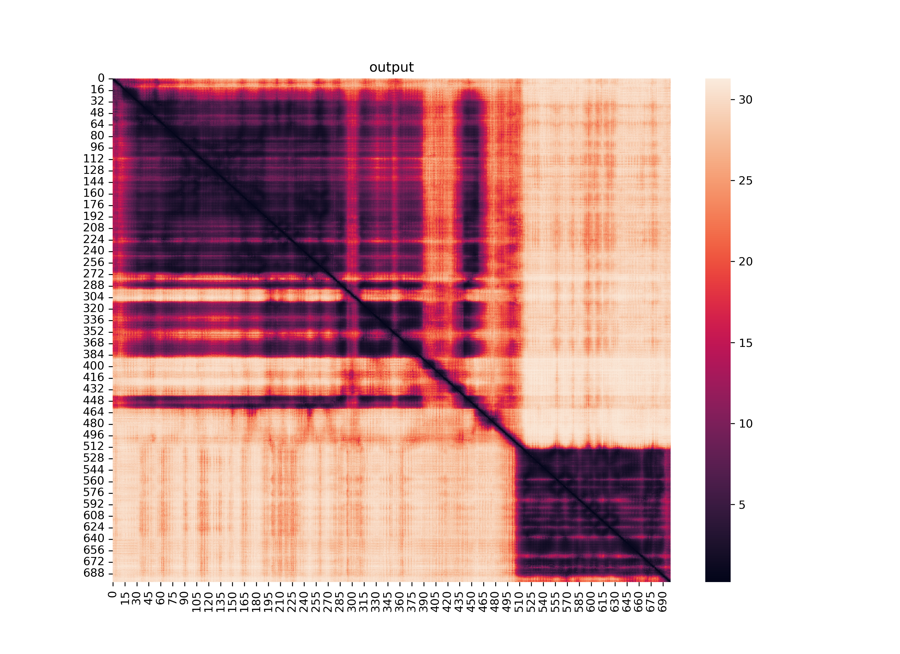

# Get cross_residue_list

This script is to extract residue pair with a PAE value under a certain threshold. 
Data cames from the JSON file!!

**FOR COMPLEX ONLY**

# Dependances
*All dependancie are from default python build, no need further installation*
- Python >= 3.7
- Pandas (default built-in)
- json (default built-in)
- numpy (default built-in)
- seaborn (default built-in)
- matplotlib (default built-in)
- argparse (default built-in)
- pathlib (default built-in)

To be safe you can create a new environment with `conda` : `conda create -n aftoolkit` (for example)

# Arguments

```bash
  -h, --help            show this help message and exit
  -f FILE, --file FILE  Json file
  -d DISTANCE, --distance DISTANCE
                        distance threeshold
  -s SEPARATION, --separation SEPARATION
                        end of first sequence (1 based)
  -o OUTPUT, --output OUTPUT
                        topfile
```

# Usage
```diff
-AlphaFold use continuous number so you have to specify to which position the sequence B starts.
```
Example usage : 
```bash
python get_cross_residue_list.py -f myfile.json -d 20 -s 505 -o output.csv
```

# Output
## CSV File
The CSV file will contain all the pairwise between protein A (sequence <= `separation`) and protein B (sequence > `separation`) for wich the PAE is under `distance`.
A column is also added, called `Residue B (index corrected)` which is an attempt to renumber residue for protein B (please tell me if you see any inconsistencies).

Output example: 
|Residue A|Residue B|PAE |Residue B (index corrected)|
|---------|---------|----|---------------------------|
|7        |508      |19.6|3                          |
|7        |509      |20.0|4                          |
|7        |511      |19.2|6                          |
|17       |511      |19.9|6                          |

## Distance matrix
The PAE distance matrix is also saved... Just in cased you need it.



